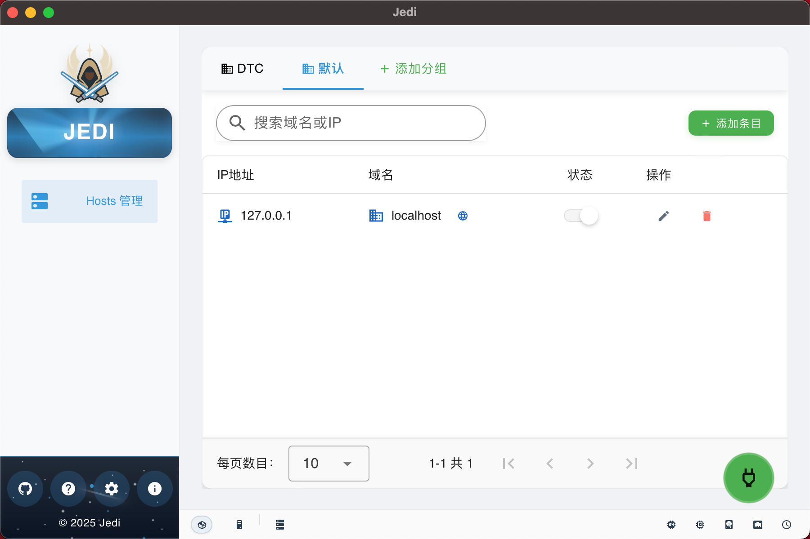

# Jedi Toolkit

> A multi-functional development toolkit to enhance productivity, currently featuring a Hosts Manager module.

English | [简体中文](README.md)

## 📷 Screenshot



## 📖 Introduction

Jedi Toolkit is a cross-platform application built with Tauri v2 and Vue 3, designed to provide developers with a series of practical tools to improve development efficiency. The currently implemented Hosts Manager module helps developers easily create, edit, and switch between different hosts configuration groups, making development, testing, and deployment processes more efficient.

The name "Jedi" is inspired by the Jedi Knights from Star Wars, symbolizing how this tool helps developers master different development environment configurations with the ease of a Jedi.

## ✨ Features

### Hosts Manager Module

- **Group Management**: Create hosts configuration groups by project or environment
- **One-Click Switching**: Quickly switch between different configurations
- **Global Toggle**: Enable/disable all hosts configurations with one click
- **Individual Entry Control**: Enable/disable specific hosts entries
- **Quick Domain Access**: Directly open domains in browser with a click

### System Features

- **System Tray**: Minimize to system tray, always available
- **Cross-Platform Support**: Works on Windows, macOS, and Linux
- **Modern Interface**: Beautiful UI based on Vuetify
- **Lightweight**: Low resource usage, fast startup
- **Dynamic Version**: Automatically reads version from Cargo.toml
- **Open Source**: Completely open source and free to use

## 🚀 Installation

### Prerequisites

- [Node.js](https://nodejs.org/) (v18+)
- [pnpm](https://pnpm.io/) (v8+)
- [Rust](https://www.rust-lang.org/) (v1.70+)
- [Tauri CLI](https://tauri.app/v2/guides/getting-started/prerequisites) (v2.x)

### Development Steps

1. Clone the repository

```bash
git clone https://github.com/yolopunk/jedi.git
cd jedi
```

2. Install dependencies

```bash
pnpm install
```

3. Run in development mode

```bash
pnpm tauri dev
```

4. Build for production

```bash
pnpm tauri build
```

### Download and Install

You can also download pre-compiled installation packages directly from the [GitHub Releases](https://github.com/yolopunk/jedi/releases) page.

- Windows: `.msi` installer
- macOS: `.dmg` installer
- Linux: `.AppImage` or `.deb` package

## 🔧 Usage Guide

### Hosts Manager Module

1. **Add Group**: Click the "+" button to create a new hosts configuration group
2. **Add Entry**: Click the "Add Entry" button in a group to add a new hosts entry
3. **Enable/Disable Entry**: Use the switch next to each entry to control its status
4. **Global Toggle**: Use the main switch at the top to control all hosts configurations
5. **Access Domain**: Click on a domain to directly access it in the browser

### Hosts File Format

Jedi uses special format markers to manage content in the hosts file:

```
# === JEDI HOSTS MANAGER ===
# +default+
127.0.0.1 localhost
# +development+
10.50.128.32 docker.dev.io
10.50.128.32 api.dev.io
# === END JEDI HOSTS MANAGER ===
```

Jedi only manages the content between these markers and does not modify other parts of the file.

### Keyboard Shortcuts

- **Ctrl+N**: Create new group
- **Ctrl+A**: Add entry
- **Ctrl+S**: Save current configuration
- **Ctrl+R**: Reload configuration
- **F1**: Open help dialog

## 🔐 Permissions

Jedi requires administrator privileges to modify the hosts file. On Windows, it will request UAC elevation; on macOS and Linux, you may need to enter an administrator password.

## 💻 Technology Stack

- **Frontend**: Vue 3 + TypeScript + Vuetify 3
- **Backend**: Rust + Tauri v2
- **Build Tool**: Vite
- **Package Manager**: pnpm

## 📚 Project Structure

```
├── src/               # Frontend source code
│   ├── api/           # API calls
│   ├── assets/        # Static resources
│   ├── components/    # Vue components
│   ├── types/         # TypeScript type definitions
│   ├── utils/         # Utility functions
│   ├── App.vue        # Main application component
│   └── main.ts        # Application entry
├── src-tauri/         # Tauri/Rust backend
│   ├── src/           # Rust source code
│   │   ├── api/       # API implementations
│   │   ├── config/    # Configuration related
│   │   └── utils/     # Utility functions
│   ├── Cargo.toml     # Rust dependencies
│   └── tauri.conf.json # Tauri configuration
├── public/            # Public resources
├── index.html         # HTML template
├── package.json       # Project configuration
└── vite.config.ts     # Vite configuration
```

## 👨‍💻 Contribution Guide

Contributions to the project are welcome! If you want to contribute code, please follow these steps:

1. Fork this repository
2. Create your feature branch (`git checkout -b feature/amazing-feature`)
3. Commit your changes (`git commit -m 'Add some amazing feature'`)
4. Push to the branch (`git push origin feature/amazing-feature`)
5. Open a Pull Request

## 📝 License

This project is licensed under the MIT License.
