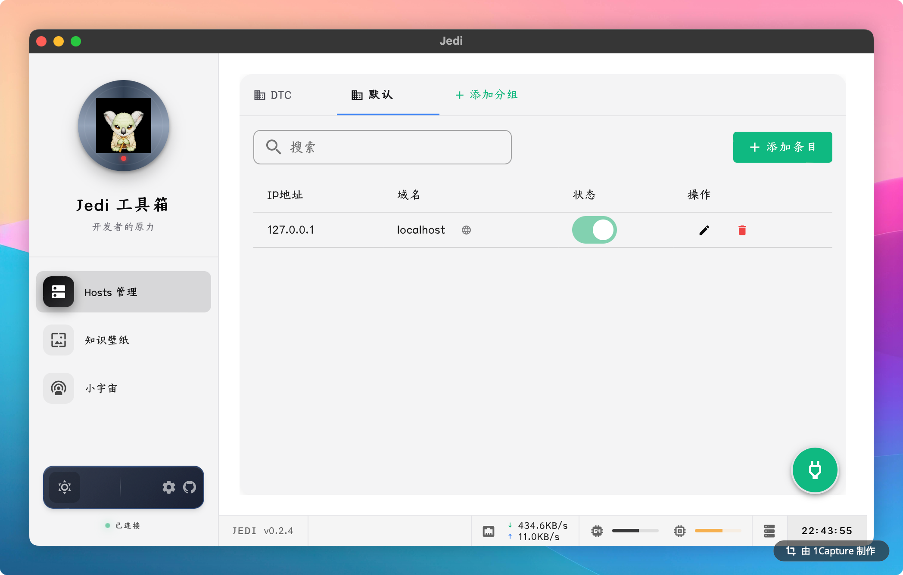
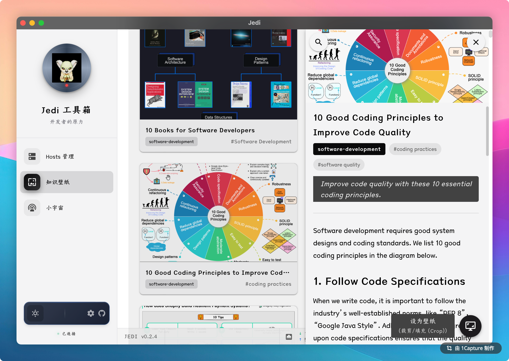
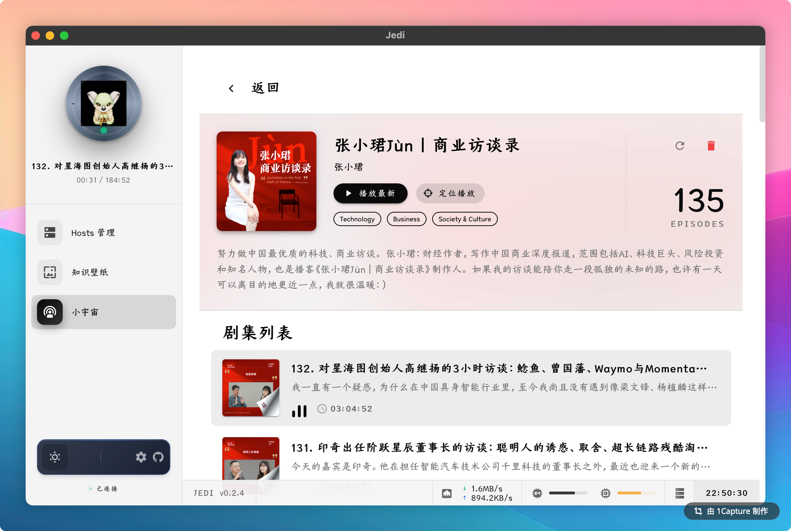
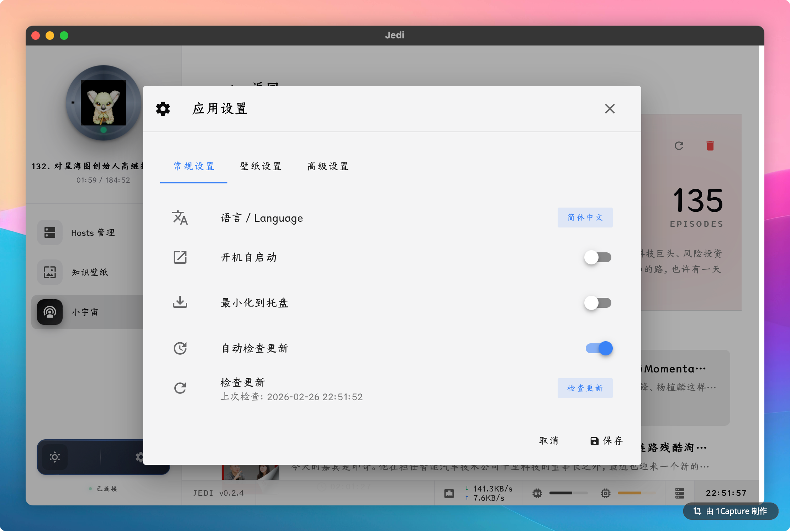
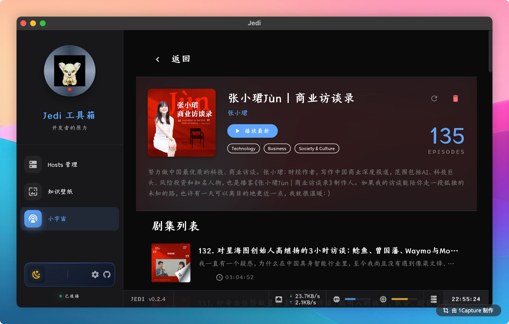

# Jedi 工具箱

> 一个多功能开发辅助工具集，面向开发者的桌面生产力工具箱。

[English](README.en.md) | 简体中文

## 📷 应用截图

### 主界面 - Hosts 管理


### 知识壁纸浏览


### 壁纸预览


### 播客库


### 播放中


### 应用设置


### 深色主题


## 📖 简介

Jedi 工具箱是一个基于 Tauri v2、Vue 3 与 Vuetify 构建的跨平台桌面应用，旨在为开发者提供一系列实用工具，提高日常开发效率。当前提供 Hosts 管理、知识壁纸、小宇宙播客、系统信息与设置等模块。

名称 "Jedi" 灵感来自《星球大战》中的绝地武士，象征着这个工具可以帮助开发者像绝地武士一样轻松掌控不同的开发环境配置。

## ✨ 功能特性

### Hosts 管理

- **分组管理**: 按项目或环境自由创建 hosts 配置组，让配置井井有条
- **一键切换**: 快速在不同环境间切换，告别手动编辑的繁琐
- **全局开关**: 一键启用/禁用所有 hosts 配置，快速切换工作模式
- **单条目控制**: 精确控制每个 hosts 条目，灵活应对各种场景
- **域名快速访问**: 直接点击域名即可在浏览器中打开，节省时间

### 知识壁纸

- **分类与标签筛选**: 快速定位你喜欢的壁纸主题，发现美好
- **预览与一键设为壁纸**: 预览详情后一键设置，让桌面焕然一新
- **内容详情展示**: 支持图文内容的深入阅读与查看

### 小宇宙播客

- **订阅管理**: 轻松添加、刷新与取消播客订阅
- **导入 OPML**: 一键导入已有订阅，无缝迁移你的播客库
- **播放控制**: 播放最新节目并快速定位当前播放进度
- **节目详情**: 完整展示 Show Notes，支持链接一键跳转

### 系统与体验

- **系统信息栏**: 实时查看 CPU、内存、网络等关键指标
- **主题切换**: 支持深色、浅色与跟随系统三种模式
- **系统托盘**: 最小化到托盘，随时快速访问
- **多语言**: 中英文界面自由切换
- **跨平台支持**: 完美支持 Windows、macOS 和 Linux
- **现代界面**: 基于 Vuetify 3 打造的一致视觉与流畅交互

## ⚡ 快速开始

1. **下载安装**: 从 [GitHub Releases](https://github.com/yolopunk/jedi/releases) 下载对应平台的安装包
2. **一键运行**: 安装完成后直接启动应用，无需额外配置
3. **开始使用**:
   - Hosts 管理中添加你的开发环境配置
   - 浏览知识壁纸找到喜欢的桌面背景
   - 导入 OPML 开始订阅播客

### 适合谁使用？

- **前端开发者**: 频繁切换本地/测试/线上环境的 Hosts。配置
- **全栈工程师**: 需要管理多个项目的域名解析
- **播客爱好者**: 喜欢在小宇宙收听技术播客
- **效率追求者**: 希望一个工具搞定多个开发辅助需求

## 🚀 安装与运行

### 预先准备

- [Node.js](https://nodejs.org/) (v18+)
- [pnpm](https://pnpm.io/) (v8+)
- [Rust](https://www.rust-lang.org/) (v1.70+)
- [Tauri CLI](https://tauri.app/v2/guides/getting-started/prerequisites) (v2.x)

### 开发步骤

1. 克隆仓库

```bash
git clone https://github.com/yolopunk/jedi.git
cd jedi
```

2. 安装依赖

```bash
pnpm install
```

3. 开发模式运行

```bash
pnpm tauri dev
```

4. 构建生产版本

```bash
pnpm tauri build
```

### 下载安装

您也可以直接从 [GitHub Releases](https://github.com/yolopunk/jedi/releases) 页面下载预编译的安装包。

- Windows: `.msi` 安装包
- macOS: `.dmg` 安装包
- Linux: `.AppImage` 或 `.deb` 包

## 🔧 使用指南

### Hosts 管理

1. **添加分组**: 点击 "+" 按钮创建新的 hosts 配置组
2. **添加条目**: 在分组中点击 "添加条目" 按钮添加新的 hosts 条目
3. **启用/禁用条目**: 使用每个条目旁边的开关控制其状态
4. **全局开关**: 使用顶部的主开关控制所有 hosts 配置
5. **访问域名**: 点击域名可在浏览器中直接访问

### Hosts 文件格式

Jedi 使用特殊的格式标记来管理 hosts 文件中的内容：

```
# === JEDI HOSTS MANAGER ===
# +默认+
127.0.0.1 localhost
# +开发环境+
10.50.128.32 docker.dev.io
10.50.128.32 api.dev.io
# === END JEDI HOSTS MANAGER ===
```

Jedi 只管理这些标记之间的内容，不会修改文件的其他部分。

### 知识壁纸

1. **浏览与筛选**: 使用分类与标签筛选壁纸
2. **预览壁纸**: 点击卡片查看完整内容
3. **设为壁纸**: 一键设置当前壁纸

### 小宇宙播客

1. **添加订阅**: 输入 RSS 或导入 OPML
2. **浏览节目**: 在节目库中查看与搜索
3. **播放与定位**: 播放最新并定位当前播放

## 🔐 权限说明

Jedi 需要管理员权限来修改 hosts 文件。在 Windows 上，它会请求 UAC 提升；在 macOS 和 Linux 上，您可能需要输入管理员密码。

## 💻 技术栈

- **前端**: Vue 3 + TypeScript + Vuetify 3
- **后端**: Rust + Tauri v2
- **构建工具**: Vite
- **包管理器**: pnpm

## 📚 项目结构

```
├── src/               # 前端源代码
│   ├── api/           # API 调用
│   ├── assets/        # 静态资源
│   ├── components/    # Vue 组件
│   ├── types/         # TypeScript 类型定义
│   ├── utils/         # 工具函数
│   ├── App.vue        # 主应用组件
│   └── main.ts        # 应用入口
├── src-tauri/         # Tauri/Rust 后端
│   ├── src/           # Rust 源代码
│   │   ├── api/       # API 实现
│   │   ├── config/    # 配置相关
│   │   └── utils/     # 工具函数
│   ├── Cargo.toml     # Rust 依赖配置
│   └── tauri.conf.json # Tauri 配置
├── public/            # 公共资源
├── index.html         # HTML 模板
├── package.json       # 项目配置
└── vite.config.ts     # Vite 配置
```

## 👨‍💻 贡献指南

欢迎对项目进行贡献！如果您想贡献代码，请遵循以下步骤：

1. Fork 这个仓库
2. 创建您的特性分支 (`git checkout -b feature/amazing-feature`)
3. 提交您的更改 (`git commit -m 'Add some amazing feature'`)
4. 推送到分支 (`git push origin feature/amazing-feature`)
5. 打开一个 Pull Request

## 📝 许可证

本项目采用 MIT 许可证。
