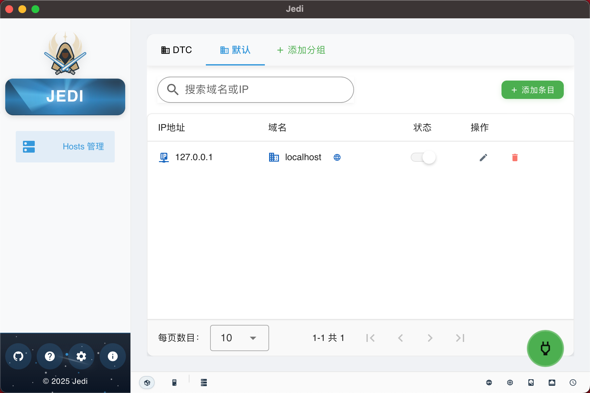

# Jedi Hosts Manager

> A powerful hosts file management tool that makes it easy to manage and switch between different environment configurations.

> 一个强大的 hosts 文件管理工具，让您轻松管理和切换不同环境的 hosts 配置。

## 📖 Introduction | 简介

Jedi Hosts Manager is a cross-platform application built with Tauri and Vue 3, designed for developers to simplify hosts file management. It allows you to create, edit, and switch between different hosts configuration groups, making development, testing, and deployment processes more efficient.

The name "Jedi" is inspired by the Jedi Knights from Star Wars, symbolizing how this tool helps developers master different network configurations with the ease of a Jedi.

Jedi Hosts Manager 是一个基于 Tauri 和 Vue 3 开发的跨平台应用程序，专为开发人员设计，用于简化 hosts 文件的管理。它允许您创建、编辑和切换不同的 hosts 配置组，使开发、测试和部署过程更加高效。

名称 "Jedi" 灵感来自星球大战中的绝地武士，象征着这个工具能够帮助开发者像绝地武士一样轻松掌控不同环境的网络配置。

## 📷 Screenshot | 应用截图



*Note: This is a placeholder image. Please replace it with an actual screenshot of your application.*

*注意：这是一个占位图片。请将其替换为您的应用程序的实际截图。*

## ✨ Features | 特性

- **Group Management**: Create hosts configuration groups by project or environment
- **One-Click Switching**: Quickly switch between different configurations
- **Global Toggle**: Enable/disable all hosts configurations with one click
- **Individual Entry Control**: Enable/disable specific hosts entries
- **System Tray**: Minimize to system tray, always available
- **Cross-Platform Support**: Works on Windows, macOS, and Linux
- **Modern Interface**: Beautiful UI based on Vuetify
- **Lightweight**: Low resource usage, fast startup

- **分组管理**：按项目或环境创建 hosts 配置组
- **一键切换**：快速在不同配置之间切换
- **全局开关**：一键启用/禁用所有 hosts 配置
- **单条目控制**：单独启用/禁用特定的 hosts 条目
- **系统托盘**：最小化到系统托盘，随时可用
- **跨平台支持**：支持 Windows、macOS 和 Linux
- **现代化界面**：基于 Vuetify 的美观界面
- **轻量级**：占用资源少，启动迅速

## 🚀 Installation | 安装

### Prerequisites | 前提条件

- [Node.js](https://nodejs.org/) (v18+)
- [pnpm](https://pnpm.io/) (v8+)
- [Rust](https://www.rust-lang.org/) (v1.70+)
- [Tauri CLI](https://tauri.app/v1/guides/getting-started/prerequisites)

### Build Steps | 构建步骤

1. Clone the repository | 克隆仓库

```bash
git clone https://github.com/yourusername/jedi.git
cd jedi
```

2. Install dependencies | 安装依赖

```bash
pnpm install
```

3. Run in development mode | 开发模式运行

```bash
pnpm tauri dev
```

4. Build for production | 构建生产版本

```bash
pnpm tauri build
```

## 🔧 Usage Guide | 使用指南

### Basic Operations | 基本操作

1. **Add Group**: Click the "+" button to create a new hosts configuration group
2. **Add Entry**: Click the "Add" button in a group to add a new hosts entry
3. **Enable/Disable Entry**: Use the switch next to each entry to control its status
4. **Global Toggle**: Use the main switch at the top to control all hosts configurations

1. **添加分组**：点击 "+" 按钮创建新的 hosts 配置组
2. **添加条目**：在分组中点击 "添加" 按钮添加新的 hosts 条目
3. **启用/禁用条目**：使用每个条目旁边的开关控制其状态
4. **全局开关**：使用顶部的主开关控制所有 hosts 配置

### Hosts File Format | hosts 文件格式

Jedi uses special format markers to manage content in the hosts file:

```
# === JEDI HOSTS MANAGER ===
# +default+
127.0.0.1 localhost
# +development+
10.50.128.32 docker.dev.io
10.50.128.32 api.dev.io
# === END JEDI HOSTS MANAGER ===
```

Jedi only manages the content between these markers and does not modify other parts of the file.

Jedi 使用特殊的格式标记来管理 hosts 文件中的内容：

```
# === JEDI HOSTS MANAGER ===
# +默认+
127.0.0.1 localhost
# +开发环境+
10.50.128.32 docker.dev.io
10.50.128.32 api.dev.io
# === END JEDI HOSTS MANAGER ===
```

Jedi 只管理这些标记之间的内容，不会修改文件的其他部分。

## 🔒 Permissions | 权限说明

Jedi requires administrator privileges to modify the hosts file. On Windows, it will request UAC elevation; on macOS and Linux, you may need to enter an administrator password.

Jedi 需要管理员权限来修改 hosts 文件。在 Windows 上，它会请求 UAC 提升；在 macOS 和 Linux 上，可能需要输入管理员密码。

## 📄 License | 许可证

This project is licensed under the MIT License.

本项目采用 MIT 许可证。
